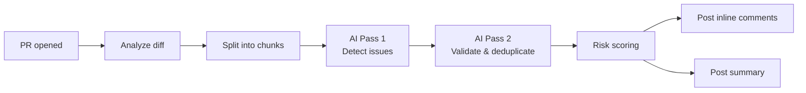

# AI PR Reviewer with DeepSeek

This GitHub Action automatically reviews pull requests using DeepSeek AI. It posts **inline comments** and a **summary** — like CodeRabbit — but runs entirely on GitHub's infrastructure.

## Zero‑Conflict Setup

Because this is a **composable GitHub Action**, you do **not** copy any files into your repo.
You just add **one 6‑line workflow file** and you're done. Nothing conflicts. Nothing to maintain.

### 1. Add the workflow file

Create `.github/workflows/pr-review.yml` in your repository:

```yaml
name: AI PR Reviewer

on:
  pull_request:
    types: [opened, synchronize, reopened, ready_for_review]

jobs:
  review:
    if: github.event.pull_request.draft == false
    runs-on: ubuntu-latest
    permissions:
      contents: read
      pull-requests: write
    steps:
      - uses: imtiyaazsalie/ai-pr-reviewer-template@main
        with:
          deepseek_api_key: ${{ secrets.DEEPSEEK_API_KEY }}
```

That's the only file you need. The default `GITHUB_TOKEN` is used automatically for posting comments — no extra secret required.

### 2. Add your DeepSeek API key

Go to **Settings → Secrets and variables → Actions** in your repo and add:

| Secret | Value |
|---|---|
| `DEEPSEEK_API_KEY` | Your [DeepSeek API key](https://platform.deepseek.com/api_keys) |

That's it. The action runs automatically on every PR.

### How it avoids conflicts

| Problem | Solution |
|---|---|
| `package.json` / `package-lock.json` | Lives in **this** repo, not yours. Nothing to merge. |
| `node_modules/` | Installed inside the action at runtime. Your repo stays clean. |
| Source files (`src/`) | Referenced by path inside the action. Zero files land in your tree. |
| Config files | Optional; create `config/monorepo.yml` in **your** repo only if you need monorepo support. |

## Features

- ✅ Inline line‑specific comments
- ✅ Two‑pass AI validation (deduplicate & reduce false positives)
- ✅ Monorepo‑aware (optional config)
- ✅ Caching – never re‑review the same commit twice
- ✅ Risk scoring with file‑criticality weighting
- ✅ Concurrent chunk processing for speed
- ✅ Optional merge with Semgrep / CodeQL results

## Advanced configuration

### Monorepo support

Create `.github/ai-reviewer.yml` in your repo:

```yaml
workspaces:
  - "packages/*"
  - "apps/*"
ignore:
  - "**/*.test.js"
  - "**/*.spec.js"
  - "docs/**"
```

### Semgrep integration

The action can merge Semgrep results into its review. Add a step **before** the action reference:

```yaml
- uses: retireddarth/semgrep-action@v1
  continue-on-error: true
  with:
    config: auto
    output: semgrep-results.json
```

The action automatically picks up `semgrep-results.json` and merges it with the AI review.

## How it works



## Tags & versioning

```yaml
uses: imtiyaazsalie/ai-pr-reviewer-template@v1    # pinned major
uses: imtiyaazsalie/ai-pr-reviewer-template@main   # latest
```
