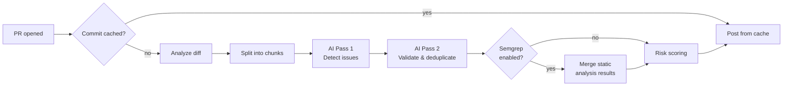

# AI PR Reviewer with DeepSeek

This GitHub Action automatically reviews pull requests using DeepSeek AI. It posts **inline comments** and a **summary** — like CodeRabbit — but runs entirely on GitHub's infrastructure.

## Zero‑Conflict Setup

Because this is a **composable GitHub Action**, you do **not** copy any files into your repo.
You just add **one workflow file** and you're done. Nothing conflicts. Nothing to maintain.

### 1. Add the workflow file

Create `.github/workflows/pr-review.yml` in your repository:

```yaml
name: AI PR Reviewer

on:
  pull_request:
    types: [opened, synchronize, reopened, ready_for_review]

jobs:
  review:
    if: github.event.pull_request.draft == false
    runs-on: ubuntu-latest
    permissions:
      contents: read
      pull-requests: write
    steps:
      - uses: imtiyaazsalie/ai-pr-reviewer-template@v1
        with:
          deepseek_api_key: ${{ secrets.DEEPSEEK_API_KEY }}
```

That's the only file you need. The default `GITHUB_TOKEN` is used automatically for posting comments — no extra secret required.

### 2. Add your DeepSeek API key

Go to **Settings → Secrets and variables → Actions** in your repo and add:

| Secret | Value |
|---|---|
| `DEEPSEEK_API_KEY` | Your [DeepSeek API key](https://platform.deepseek.com/api_keys) |

That's it. The action runs automatically on every PR.

### How it avoids conflicts

| Problem | Solution |
|---|---|
| `package.json` / `package-lock.json` | Lives in **this** repo, not yours. Nothing to merge. |
| `node_modules/` | Cached with `actions/cache@v4`. Installed in action directory at runtime. |
| Source files (`src/`) | Referenced by path inside the action. Zero files land in your tree. |
| Config files | Optional; create a config file in **your** repo if you need monorepo support. |

## Features

- ✅ Inline line‑specific comments on changed files
- ✅ Two‑pass AI validation — deduplicates and removes false positives
- ✅ Monorepo‑aware with optional workspace config
- ✅ Commit‑level caching — never re‑review the same commit twice
- ✅ Risk scoring with file‑criticality weighting (`/core/`, `auth` paths get 2× weight)
- ✅ Concurrent AI calls with configurable parallelism
- ✅ Optional Semgrep integration (toggle on)
- ✅ `node_modules` cached across runs — cold start eliminated after first PR
- ✅ 17‑test unit suite validating core logic

## All inputs

| Input | Required | Default | Description |
|---|---|---|---|
| `deepseek_api_key` | ✅ Yes | — | Your DeepSeek API key |
| `github_token` | No | `${{ github.token }}` | Token for posting PR comments |
| `enable_semgrep` | No | `false` | Run Semgrep static analysis alongside AI review |
| `max_concurrency` | No | `5` | Max concurrent AI calls (lower if hitting rate limits) |
| `config_path` | No | `""` | Path to monorepo config (e.g. `.github/ai-reviewer.yml`) |

### Full example with all options

```yaml
- uses: imtiyaazsalie/ai-pr-reviewer-template@v1
  with:
    deepseek_api_key: ${{ secrets.DEEPSEEK_API_KEY }}
    enable_semgrep: true
    max_concurrency: 3
    config_path: .github/ai-reviewer.yml
```

## Advanced configuration

### Monorepo support

Create a YAML config file in your repo (default path is `config/monorepo.yml`, or use `config_path` to customize):

```yaml
workspaces:
  - "packages/*"
  - "apps/*"
ignore:
  - "**/*.test.js"
  - "**/*.spec.js"
  - "docs/**"
```

Without a config, the action auto‑filters out lockfiles, `dist/`, `node_modules/`, and markdown files.

### Semgrep integration

Set `enable_semgrep: true` — the action runs Semgrep with `config: auto` and merges findings into the AI review, deduplicating overlapping issues.

### Rate limiting

If you hit DeepSeek `429` responses, lower the parallelism:

```yaml
max_concurrency: 2   # or 1 for strict serial
```

## How it works



## Running tests

```bash
npm install
npm test   # 17 tests, <1s
```

## Tags & versioning

```yaml
uses: imtiyaazsalie/ai-pr-reviewer-template@v1    # pinned major (recommended)
uses: imtiyaazsalie/ai-pr-reviewer-template@main   # latest commit
```
